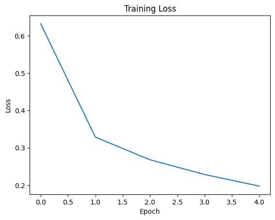
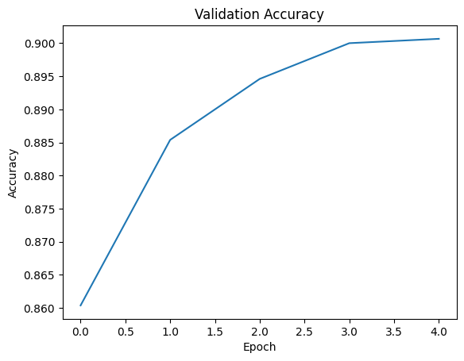
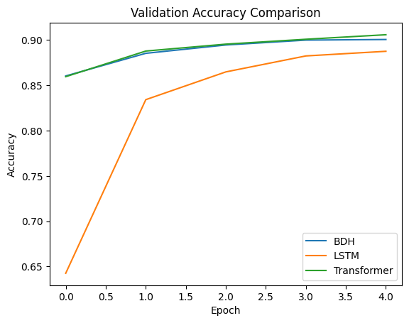
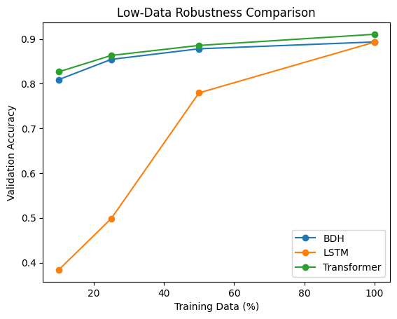

# NLP-Hatchling

Comparative implementations of **BDH (Baby Dragon Hatchling)**, **Transformer**, and **LSTM (RNN)** models evaluated on small-scale NLP benchmarks.

This repository investigates whether BDH can achieve competitive performance with standard Transformer architectures under controlled experimental settings.

---

## Project Goal

To perform a **fair, controlled comparison** between:

- BDH (Baby Dragon Hatchling)
- Transformer Encoder
- LSTM (Recurrent Neural Network)

All models are:

- Matched for parameter count (~2.6M parameters)
- Trained under identical conditions
- Evaluated on the same dataset
- Compared on accuracy, memory usage, and training speed

---

## Benchmark

### Dataset: AG News

- 120,000 training samples
- 7,600 test samples
- 4 classification categories:
  - World
  - Sports
  - Business
  - Sci/Tech

Loaded via HuggingFace `datasets`.

---

## Model Configurations

All models configured to ~2.6M parameters for fairness.

| Model        | Parameters |
|-------------|-----------|
| BDH         | ~2.66M    |
| LSTM        | ~2.62M    |
| Transformer | ~2.71M    |

**Common Training Setup**

- Embedding dimension: 128 (BDH) / tuned for baselines
- Training epochs: 5  
- Optimizer: AdamW (lr = 3e-4)  
- Batch size: 64  
- Max sequence length: 128  

---

## Results (Single Seed)

| Model        | Validation Accuracy | Peak GPU Memory | Epoch Time |
|-------------|--------------------|----------------|------------|
| BDH         | 90.07%             | 536 MB         | ~43 sec    |
| LSTM        | 88.76%             | 314 MB         | ~49 sec    |
| Transformer | 90.59%             | 342 MB         | ~40 sec    |

---

## Training Curves

### Training Loss (BDH)

---

### Validation Accuracy (BDH)

---

### Validation Accuracy Comparison

BDH vs LSTM vs Transformer

---

### Limited Data Regime Comparison

Performance under reduced training data settings.

---

## Key Observations

- BDH significantly outperforms LSTM at comparable parameter count.
- BDH achieves performance competitive with Transformer.
- Transformer remains marginally superior in final accuracy.
- BDH currently shows higher GPU memory usage due to custom implementation design.
- In low-data settings, BDH demonstrates stable generalization behavior.

---

## Research Focus

This repository explores:

- Architectural competitiveness of BDH
- Low-resource NLP performance
- Parameter-efficiency tradeoffs
- Controlled experimental methodology

Planned extensions:

- Multi-seed evaluation (statistical robustness)
- Additional NLP benchmarks (SST-2, IMDB)
- Memory optimization for BDH
- Ablation studies

---

## Reproducibility

- Fixed random seeds
- Identical training conditions
- Parameter-matched architectures
- GPU memory measured via PyTorch CUDA profiling

Models are intentionally kept small to allow experimentation on consumer GPUs (e.g., RTX 3060, T4).

---

## License

MIT License

---

## Author

Tushar Jagannath Jagtap
